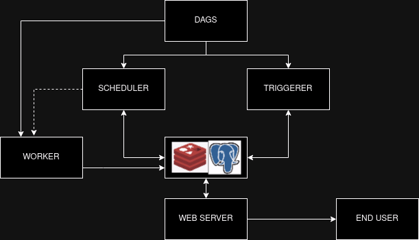

# Minimal Airflow Docker Compose deployment
## Overview

The application is based off of Docker Compose to fully deploy a functional Airflow environment.

The compose file is heavily based on the example given in the [Airflow documentation](https://airflow.apache.org/docs/apache-airflow/stable/howto/docker-compose/index.html)

## Docker Compose

The steps defined in the `compose.yaml` file are:

- Defines common environment variables for all containers(`airflow-comon-env`);
- defines three volumes based on project root directories (`dags`, `logs` and `plugins`);
- defines common dependencies for all containers on postgres and redis (`airflow-common-depends-on`);
- container definitions for each airflow components

## Troubleshooting process

First issues came up from a top level reading of the file, in which I changed the `POSTGRES_USER` variable from `admin` to `airflow`on line 31.

After that I initially had some issues with the user ID for airflow, which is by default `50000`. It would likely work if the UID was set to `1000`, but I would rather keep it at an expeted standard.

After getting the Airflow UI up and running I noticed that there weren't any DAGs, so I listed the contents of `/opt/airflow/dags`, only to find it empty. I then looked slightly to the left and saw that the `dags` directory was incorrectly named `dag`, and changed that as well.

After that I went throught the DAG to see if it looked right and my handy linter whispered to me that there was a missing `:` at function declaration.

With all that fixed, I ran my DAG on the interface. [Logs are attached](./logs/scheduler/2024-08-31/smooth.py.log).

## Airflow Architecture

There are several examples of the architecture in Airflow's own [documentation](https://airflow.apache.org/docs/apache-airflow/stable/core-concepts/overview.html). I added a few more things to better fit what I belive is the intended working state of this deployment:

## Cloud Architecture Propositions

Sticking to the Docker Compose approach, we could set auto scaling groups tied to ECS in order to scale parts of the infrastructure 